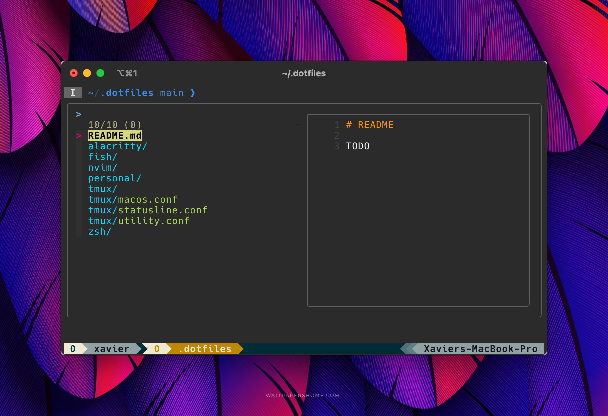
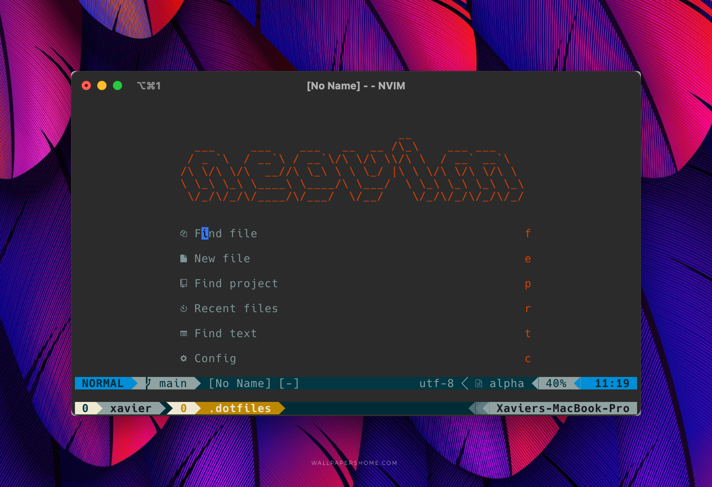
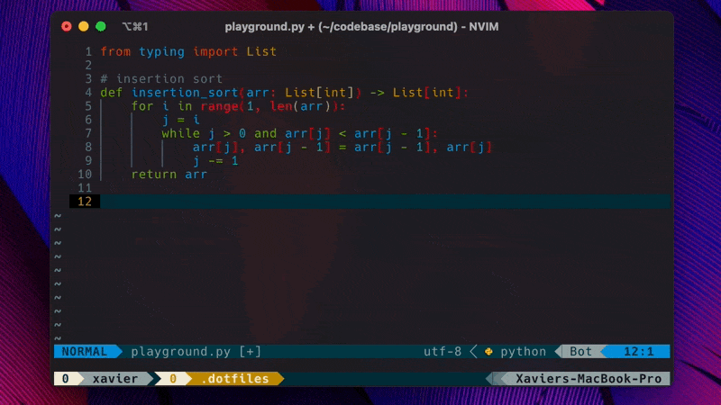

# README

## TOC

<!-- vim-markdown-toc GFM -->

- [TOFIX](#tofix)
- [TODO](#todo)
- [Preview](#preview)
- [Credit and Inspiration](#credit-and-inspiration)
  - [ChristianChiarulli AKA chris@machine](#christianchiarulli-aka-chrismachine)
  - [Craftzdog](#craftzdog)
  - [ThePrimeagen](#theprimeagen)

<!-- vim-markdown-toc -->

STILL IN PROGRESS!!!!!

## TOFIX

- [] Where did my smart intellisense go
- [] Make custom snippets show

## TODO

- [] Give better credit to each shoutout (youtube link, blog link, socials with icons, etc)
- [] Better gif quality?
- [] List out all extensions
- [] Create 'bones' branch with a lot less extensions
- [] List out keybinds I'm using 24/7 so its easier for a fresh-installer to jump in

## Preview

## Credit and Inspiration

First and foremost I want to give a shout out to the following people. Without diving into their settings as inspiration I would still be scratching my head on how to even add an extension let alone a clean setup.

I have shamelessly copy-pasted a lot of the following peoples settings and tweaked it for my needs.

### [ChristianChiarulli AKA chris@machine](https://github.com/ChristianChiarulli)

His nvim dotfiles and youtube videos helped me so much with getting my feet wet with a custom neovim configuration.

- [Youtube](https://www.youtube.com/@chrisatmachine)
- [Website](https://www.chrisatmachine.com/)
- [Nvim settings I frequently went to](https://github.com/ChristianChiarulli/nvim/tree/master/lua/user)

### [Craftzdog](https://github.com/craftzdog)

Currently my rolemodel for developing apps. LOVE his clean theme and almost all his youtube videos. PLEASE check out his website, blog, guide, etc if you really want to be inspired as an independent developer who uses neovim! His [blog](https://dev.to/craftzdog/a-productive-command-line-git-workflow-for-indie-app-developers-k7d) helped me a lot with a cleaner git workflow.

- [Youtube](https://www.youtube.com/@devaslife)
- [Dev.to blog](https://dev.to/craftzdog)
- [Personal Website](https://www.craftz.dog/)

### [ThePrimeagen](https://github.com/ThePrimeagen)

The man who opened my eyes in the first place with how powerful vim is and showed me the light that it is possible to switch from VSCode to terminal and still be top tier without going crazy (ok maybe a little crazy). Love this guy!

- [Youtube](https://www.youtube.com/c/theprimeagen)
