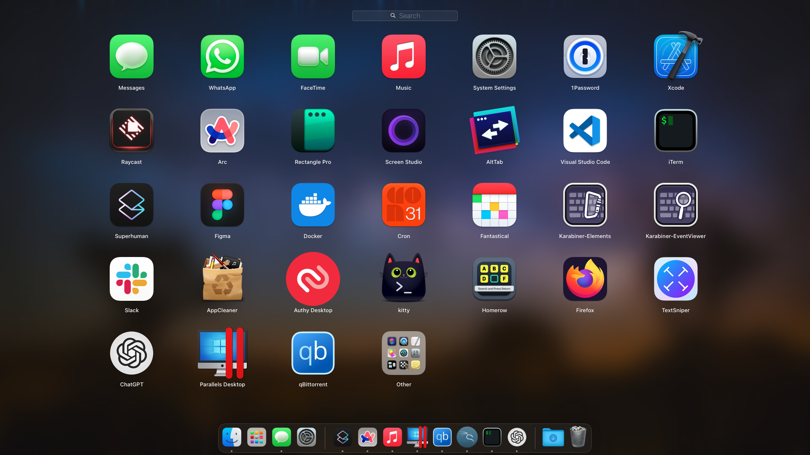

# README

## Credit and Inspirations

Without these people and their resources I would not have been able to even start with my dotfiles.

- [ThePrimeagen](https://www.youtube.com/@ThePrimeagen)
- [Craftzdog](https://www.youtube.com/channel/UC7yZ6keOGsvERMp2HaEbbXQ)
- [Max Stoiber](https://www.youtube.com/@MaxStoiber)

## Links to Where I got all this Info

-[Awesome CLI workflow for git](https://dev.to/craftzdog/a-productive-command-line-git-workflow-for-indie-app-developers-k7d)

## Software Needed

This is the software you need for full functionality of my dotfiles

- [Karabiner Elements](https://karabiner-elements.pqrs.org/)
- [Rectangle Window Managmenet](https://rectangleapp.com/)
- [Screen Studio](https://www.screen.studio/download)
- [Raycast](https://raycast.com/)

## CLI QOL

- [Commitizen](https://github.com/commitizen/cz-cli)
  `brew install commitizen`
- [Tig](https://github.com/jonas/tig)
  `$ brew install tig`

## Features of my dotfiles

### Neovim

My neovim settings which I use to code and develop. I did not make my settings for the purpose of being able to read and understand from an outsiders POV. This will be a future update.
